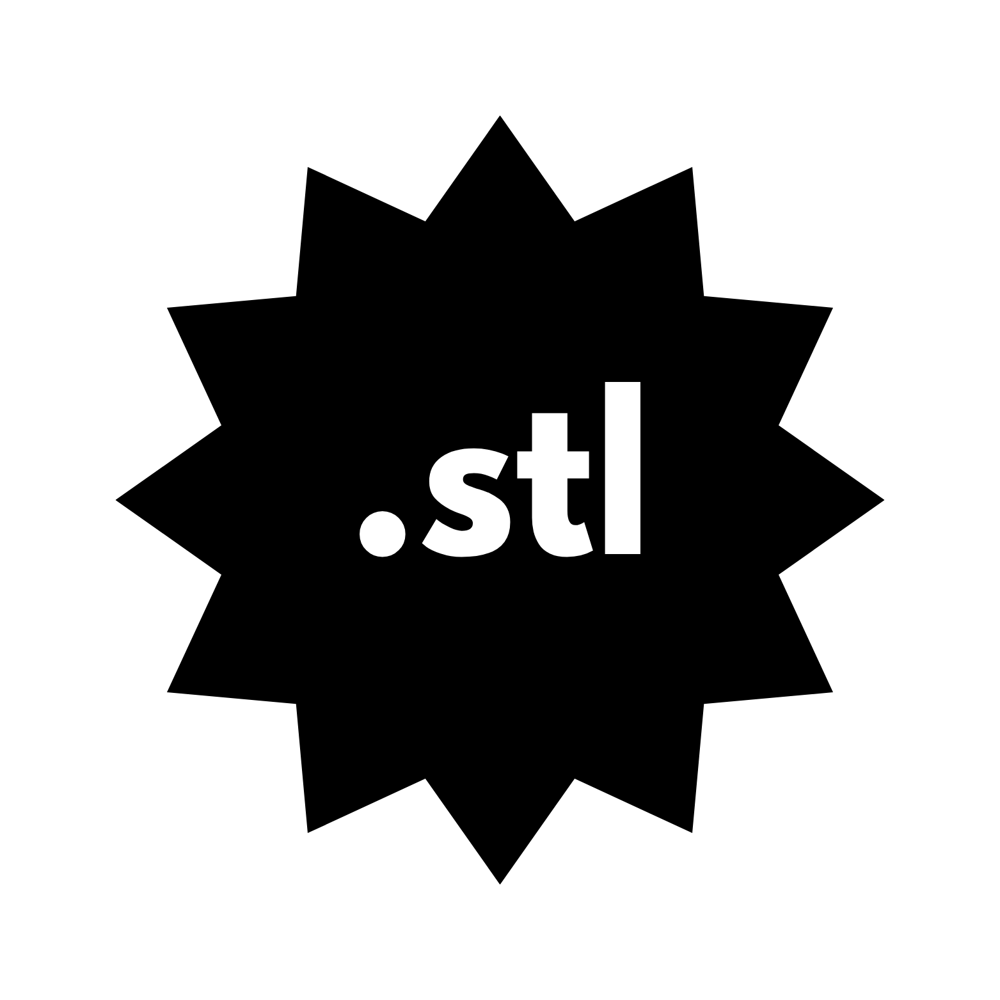

  

  <b>GitHub Repository Stats</b> 
  <b>Stars:</b> 
  &nbsp;|&nbsp;
  <b>Forks:</b> 
  &nbsp;|&nbsp;
  <b>Open Issues:</b> 
  &nbsp;|&nbsp;
  <b>Last Commit:</b> 

## Project Goals
A language that's fast, expressive like Python, and compiles like Rust — designed by the fellow engineers.

## Getting Started

Instructions on how to build and run StelLang will be added here as the project progresses.

## Contributing

Information on how to contribute to StelLang will be added later.

---
*Note: This language is under active development. Features and syntax may change.*